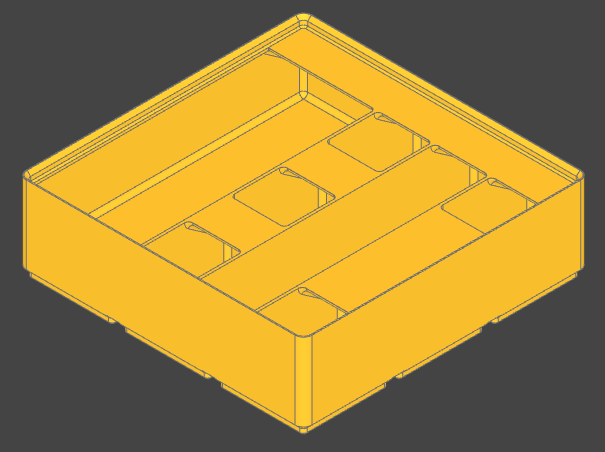

# gridfinity_build123d
Gridfinity (design by Zack Freedman) is a grid based storage solution. This repository contains python modules to create gridfinity capable objects in [build123d](https://github.com/gumyr/build123d) .



# Instalation 

```bash
python3 -m pip install git+https://github.com/Ruudjhuu/gridfinity_build123d
```

# Usage
```python
from build123d import BuildPart
from gridfinity_build123d import (
    Base,
    Bin,
    Utils,
    CompartmentsEqual,
    Compartment,
)

from gridfinity_build123d.utils import Direction


with BuildPart() as part:
    Base(grid_x=2, grid_y=1)
    Bin(
        face=Utils.get_face_by_direction(Direction.TOP),
        height=Utils.remaining_gridfinity_height(units=3),
        compartments=CompartmentsEqual(compartment_list=[Compartment()]),
    )

part.part.export_stl("bin_2x1x3.stl")

```