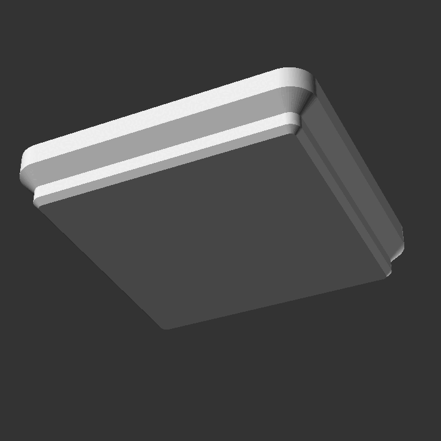

# gridfinity_build123d
Gridfinity (design by Zack Freedman) is a grid based storage solution. This repository contains python modules to create gridfinity capable objects in [build123d](https://github.com/gumyr/build123d).

See the [documentation](http://gridfinity-build123d.readthedocs.io/) for more information and examples.

 


# Installation

```bash
python3 -m pip install git+https://github.com/Ruudjhuu/gridfinity_build123d
```

# Usage
```python
import build123d
from gridfinity_build123d import (
    BaseEqual,
    Bin,
    Compartment,
    CompartmentsEqual,
)

part = Bin(
    BaseEqual(grid_x=2, grid_y=1),
    height_in_units=3,
    compartments=CompartmentsEqual(compartment_list=[Compartment()]),
)

build123d.export_stl(part, "bin_2x1x3.stl")
build123d.export_step(part, "bin_2x1x3.step")

```

# Credits
@zackfreedman -- [gridfinity](https://youtu.be/ra_9zU-mnl8)
[grizzie17](https://www.printables.com/@grizzie17) -- [gridfinity-refined](https://www.printables.com/model/413761-gridfinity-refined)
