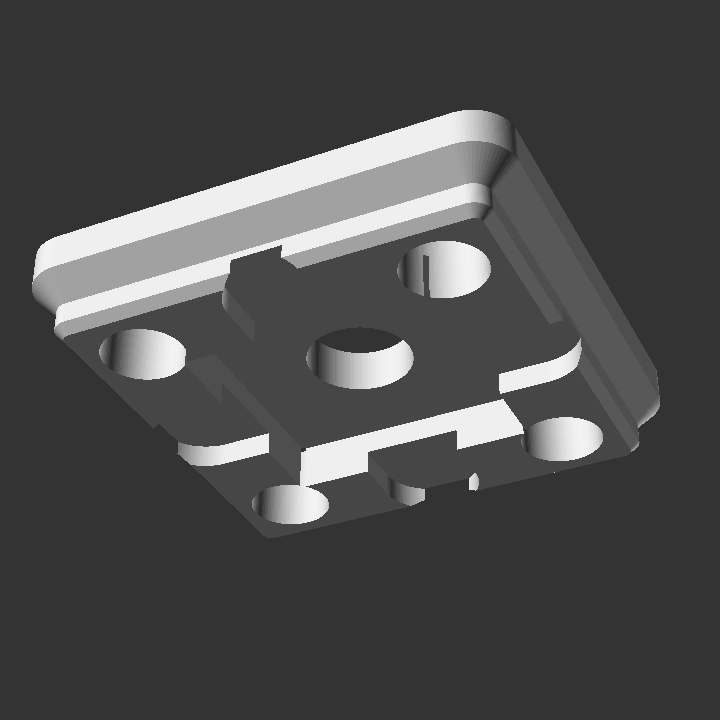
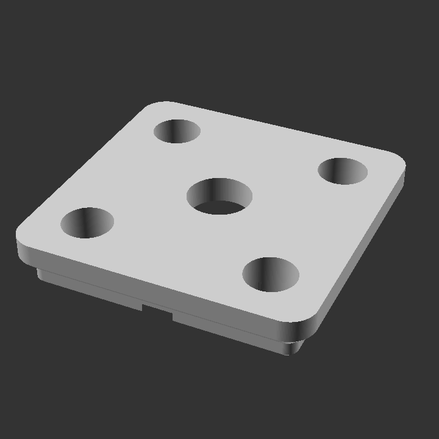

Features
========

Multiple objects in this library support features as argument. These features are applied to the objects acording to :class:`gridfinity_build123d.features.FeatureLocation`.

Example:

The following code creates a feature rich base:

.. testsetup:: *

    from gridfinity_build123d import *

.. testcode::

    Base(
        features=[
            MagnetHole(feature_location=TopCorners()),
            ScrewHoleCountersink(feature_location=TopMiddle()),
            ScrewHoleCounterbore(feature_location=BottomCorners()),
            Weighted(feature_location=BottomMiddle()),  # type: ignore[list-item]
        ],
    )

With as result:

Features List
=============

.. grid:: 2

    .. grid-item-card:: :class:`gridfinity_build123d.HoleFeature`

        .. image:: ../assets/hole_feature.png

        +++
        Just a hole

    .. grid-item-card:: :class:`gridfinity_build123d.ScrewHole`

        .. image:: ../assets/screw_hole.png

        +++
        Hole with default gridfinity base screwhole size.

    .. grid-item-card:: :class:`gridfinity_build123d.MagnetHole`

        .. image:: ../assets/magnet_hole.png

        +++
        Hole with default gridfinity magnet size.

    .. grid-item-card:: :class:`gridfinity_build123d.ScrewHoleCountersink`

        .. image:: ../assets/countersink.png

        +++
        Countersink hole.

    .. grid-item-card:: :class:`gridfinity_build123d.ScrewHoleCounterbore`

        .. image:: ../assets/counterbore.png

        +++
        Counterbore hole.

    .. grid-item-card:: :class:`gridfinity_build123d.Weigthed`

        .. image:: ../assets/weigthed.png

        +++
        Cutout for weighted baseplates.

    .. grid-item-card:: :class:`gridfinity_build123d.Label`

        .. image:: ../assets/label.png

        +++
        Label for bin compartments.
