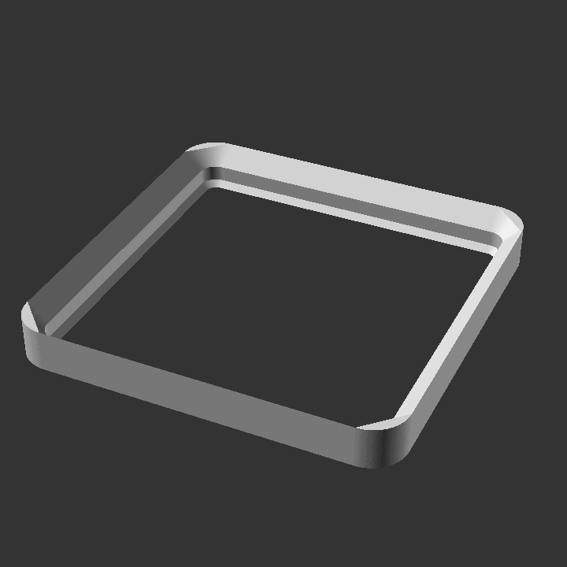
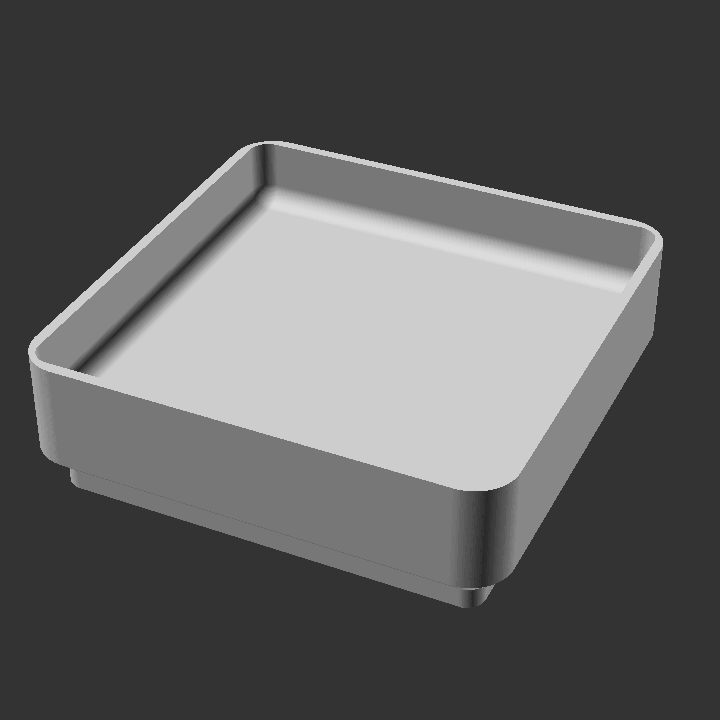

.. gridfinity_build123d documentation master file, created by
   sphinx-quickstart on Sat Dec  9 21:24:49 2023.
   You can adapt this file completely to your liking, but it should at least
   contain the root `toctree` directive.

Welcome to gridfinity_build123d's documentation!
================================================
Gridfinity is a storage system created by Zack Freedman, partly inspired by Alexander Chappell's assortment system.
This repository is a Python library for constructing Gridfinity objects using Build123d, aiming to be one of the most modular Gridfinity generation tools.

Overview
========

This module contains a set of "Root objects" that hold arguments to pass through a list of "features". 
Features are applied to the root object. For example, the root object BasePlate can include a Feature MagnetHole. 
Features have FeatureLocations, providing the user with the flexibility to place features wherever they desire.

Grids
=====
Most Gridfinity tools out there have the posibility to create rectangular object.
Gridfinity_build123d give power users the ability to use a grid definition and create all imaginable shapes.

Index
=====
.. toctree::
   :maxdepth: 2
   :caption: Contents:

   objects.rst
   features.rst
   reference.rst

Indices and tables
==================

* :ref:`genindex`
* :ref:`modindex`
* :ref:`search`
